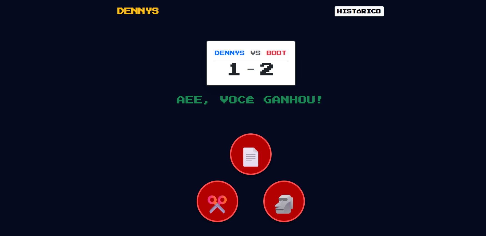

# 👊✋✌️ Jokempo

Aplicação web do clássico **Pedra, Papel e Tesoura** com histórico de partidas.


*(Substitua "caminho-da-sua-imagem.png" pelo nome real do arquivo)*

## 🛠️ Tecnologias Utilizadas

O projeto foi desenvolvido seguindo o padrão de arquitetura **MVC (Model-View-Controller)**.

* **Back-end**
    * **Python & Flask:** Utilizados para a construção da lógica e das rotas da API.
    * **SQLAlchemy:** Responsável por gerenciar a persistência dos dados (ORM).

* **Front-end**
    * **HTML5, CSS3 & Bootstrap 5:** Criação da interface responsiva e estilizada.
    * **JavaScript (Fetch API):** Implementação de comunicação assíncrona (`async/await`) para atualizar o placar e o histórico sem recarregar a página.

* **Banco de Dados**
    * **SQLite:** Banco de dados relacional leve, ideal para persistência local e prototipagem rápida.

## 🚀 Como Rodar o Projeto

### Pré-requisitos 

Antes de começar, você vai precisar ter instalado em sua máquina as seguintes ferramentas:
[Git](https://git-scm.com), [Python](https://www.python.org/downloads/).
Além disso, é bom ter um editor para trabalhar com o código como [VSCode](https://code.visualstudio.com/).

### 🎲 Rodando a Aplicação

```bash
# Clone este repositório
$ git clone <https://github.com/danielpf30/Jokempo.git>

# Acesse a pasta do projeto no terminal/cmd
$ cd Jokempo_python

# --- CONFIGURANDO O AMBIENTE VIRTUAL (RECOMENDADO)---

# 1. Crie o ambiente virtual
$ python -m venv venv

# 2. Ative o ambiente virtual
# No Windows:
$ .\venv\Scripts\activate
# No Linux/Mac:
$ source venv/bin/activate

# (Seu terminal deve mostrar (venv) antes do caminho agora)

# ---------------------------------------

# Instale as dependências
$ pip install -r requirements.txt

# Execute a aplicação
$ python app.py

# O servidor iniciará na porta:5000 - acesse [http://127.0.0.1:5000](http://127.0.0.1:5000)